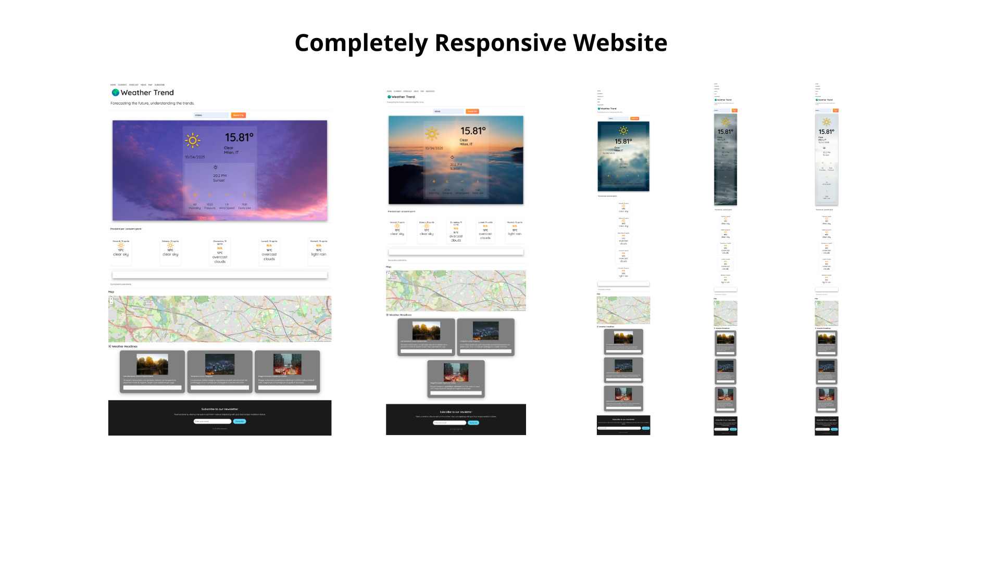

🌤️ Weather App React / Express / OpenWeather API

A sleek, user-friendly weather application built with React for the frontend and Express.js for the backend. This app allows users to check the current weather and forecasts for any location they search for, fetching data from the OpenWeather API.

🖼️ Project Overview

🚀 Key Features
Search by City: Search for weather data by entering a city name.

Weather Forecast: Get a 5-day weather forecast, including temperature, humidity, wind speed, and more.

Responsive Design: The app adapts to both mobile and desktop devices.

Dark/Light Mode: Toggle between dark and light themes to suit your preference.

Current Location: Automatically fetch weather data based on the user’s current location using geolocation.

Smooth Animations: Interactive and smooth transitions for a modern feel.

🛠️ Technologies Used
Frontend: React for building an interactive and dynamic user interface.

Backend: Express.js for handling API requests and routing.

Weather API: OpenWeatherMap API to fetch real-time weather data.

Styling: Custom CSS + Flexbox for a responsive layout.

Node.js: Runtime for the React app and Express backend.

📋 How to Run
Backend Setup (Express.js)
Clone the repository:

git clone https://github.com/your-username/weather-app.git
cd weather-app
Install dependencies: Make sure you have Node.js and npm installed.

Get an API Key:

Sign up at OpenWeatherMap to get your API key.

Insert the API key into the server.js file (under the API request section).

Start the backend: Run the following command to start the Express server:

npm start
The backend will be running at http://localhost:5000.

Frontend Setup (React)
Navigate to the frontend directory:

cd frontend
Install dependencies: Ensure that Node.js and npm are installed. Then, run:

npm install
Start the frontend: Run the React frontend using:

npm start
The frontend will be available at http://localhost:3000.

📊 Contributing
We welcome contributions! If you would like to help improve the app, feel free to fork the repository and submit a pull request.

Steps to contribute:
Fork the repo

Clone your fork to your local machine

Create a new branch:

git checkout -b feature/your-feature-name
Commit your changes

Push to your branch

Open a pull request

📌 Notes
Make sure you are running both the backend and frontend for the app to work properly.

If you're facing permission issues, try running commands as an Administrator.

📄 License
MIT License

Copyright (c) 2025 [Probyte5D]

Permission is hereby granted, free of charge, to any person obtaining a copy of this software and associated documentation files (the "Software"), to deal in the Software without restriction, including without limitation the rights to use, copy, modify, merge, publish, distribute, sublicense, and/or sell copies of the Software, and to permit persons to whom the Software is furnished to do so, subject to the following conditions:

The above copyright notice and this permission notice shall be included in all copies or substantial portions of the Software.

THE SOFTWARE IS PROVIDED "AS IS", WITHOUT WARRANTY OF ANY KIND, EXPRESS OR IMPLIED, INCLUDING BUT NOT LIMITED TO THE WARRANTIES OF MERCHANTABILITY, FITNESS FOR A PARTICULAR PURPOSE AND NONINFRINGEMENT. IN NO EVENT SHALL THE AUTHORS OR COPYRIGHT HOLDERS BE LIABLE FOR ANY CLAIM, DAMAGES OR OTHER LIABILITY, WHETHER IN AN ACTION OF CONTRACT, TORT OR OTHERWISE, ARISING FROM, OUT OF OR IN CONNECTION WITH THE SOFTWARE OR THE USE OR OTHER DEALINGS IN THE SOFTWARE.

